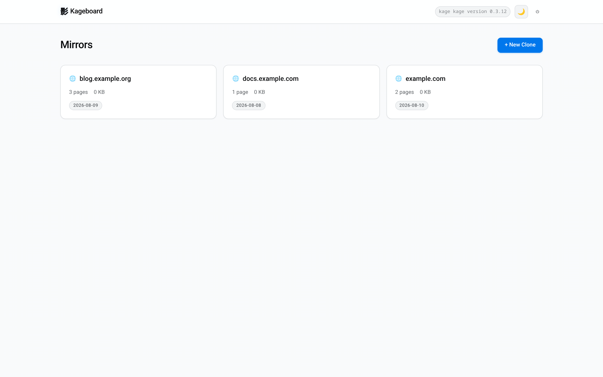
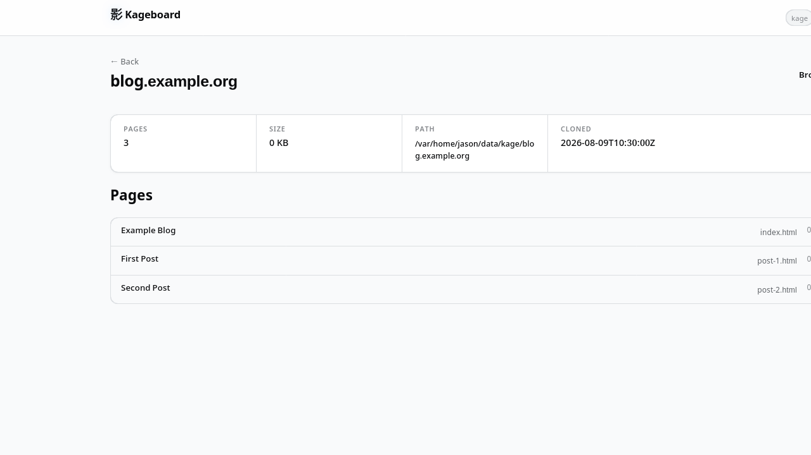
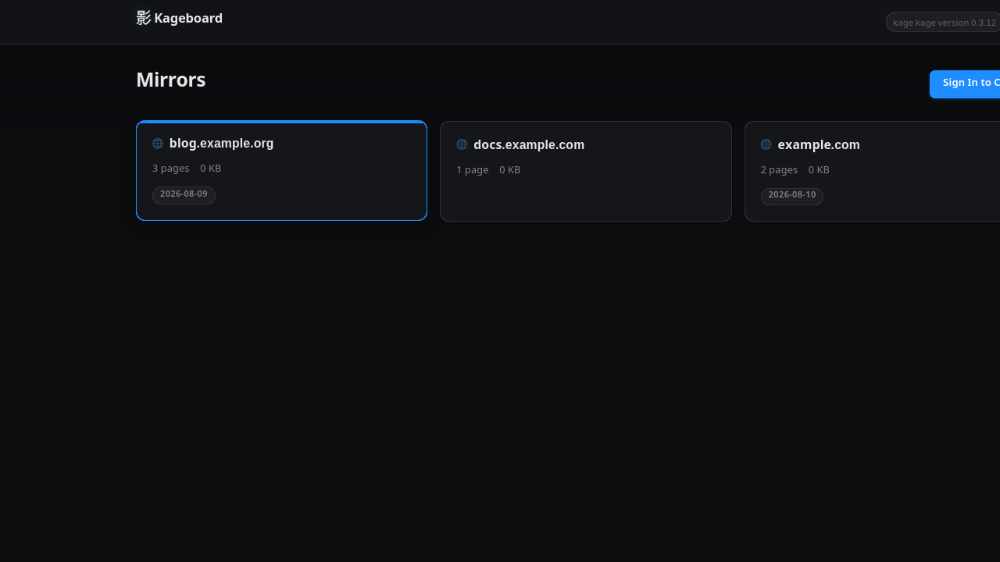
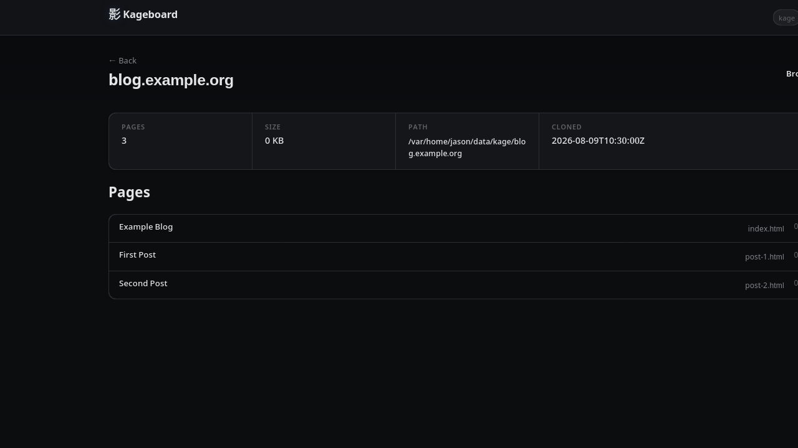

# 影 Kageboard

Web dashboard for [Kage](https://github.com/tamnd/kage) — manage, clone, browse, and pack offline website mirrors from your browser.

Kage is a fantastic CLI for freezing websites into offline mirrors. Kageboard gives it a web UI so you can manage your library of mirrors without remembering flags.






## Features

- **Mirror library** — browse all your cloned sites in a grid with page counts and sizes
- **Clone from the browser** — paste a URL, set scope/depth, watch live progress via WebSocket. Advanced options: scope prefix, excluded paths, keep media/PDFs, mobile readability, force re-clone
- **Browse mirrors inline** — view mirrored pages through an iframe with the toolbar stripped
- **Pack to ZIM** — trigger ZIM archive creation from the UI
- **Refresh mirrors** — re-render an existing mirror in place (`kage clone --refresh`) with live progress
- **Delete mirrors** — clean up old mirrors with one click
- **Basic auth** — write operations (clone, delete, pack) behind authentication; read-only endpoints public
- **Dark mode** — automatic via `prefers-color-scheme` with manual toggle; preference saved to localStorage
- **Chrome/Firefox extension** — one-click "save this page" from the toolbar
- **htmx + Alpine.js** — lightweight interactivity, no build step, no SPA framework

## Install

```bash
git clone https://github.com/jcrabapple/kageboard.git
cd kageboard
pip install .
```

Requires **kage** on your PATH. Install it first:

```bash
go install github.com/tamnd/kage/cmd/kage@latest
```

## Quick Start

```bash
kageboard --port 5000
# Prints: 🔐 Generated credentials — username: kageboard  password: <random>
# Open http://127.0.0.1:5000
```

Or run directly:

```bash
python3 -m kageboard.cli --port 5000
```

On first run without credentials, Kageboard generates a random password and prints it to the terminal. Set your own with CLI flags or environment variables.

### Browser Extension

The `extension/` directory contains a Chrome/Firefox extension for one-click saving:

1. Open `chrome://extensions` (Chrome) or `about:addons` (Firefox)
2. Enable "Developer mode" (Chrome) or click the gear → "Debug Add-ons" (Firefox)
3. "Load unpacked" → select the `extension/` folder
4. Click the 影 icon in your toolbar on any page to save it to Kageboard

The extension supports **save current page** or **clone entire site** with configurable depth and scope. It lists your recent mirrors in the popup and links to the Kageboard dashboard.

### Authentication

Write operations (clone, delete, pack) require authentication. Read operations (listing mirrors, job status) are public.

| Client | How to authenticate |
|--------|-------------------|
| **Browser** | Navigate to the dashboard → redirected to `/login`. Sign in with your credentials. |
| **Extension** | Popup shows a login form on first use. Credentials are stored in `chrome.storage.sync` and sent as HTTP Basic Auth on every API call. |
| **API** | Send `Authorization: Basic <base64(user:pass)>` on write endpoints. Check auth status with `GET /api/auth/check`. |

## CLI Options

| Flag | Default | Meaning |
|------|---------|---------|
| `--host` | `127.0.0.1` | Bind address |
| `--port` | `5000` | Bind port |
| `--debug` | `false` | Flask debug mode |
| `--username` | `kageboard` | Basic auth username |
| `--password` | *(random)* | Basic auth password |

Environment variables: `KAGEBOARD_USERNAME`, `KAGEBOARD_PASSWORD`.

## How It Works

Kageboard wraps the `kage` CLI — it calls `kage clone`, `kage serve`, `kage pack` as subprocesses and tracks their output. State is on-disk: your mirrors live wherever Kage puts them (`~/data/kage/` by default). Kageboard just reads and manages them.

```
kageboard/
├── kageboard/
│   ├── app.py          # Flask routes + WebSocket
│   ├── auth.py         # HTTP Basic Auth + session auth for the web UI
│   ├── kage.py         # Kage CLI wrapper (clone, serve, pack, mirror scanning)
│   ├── manager.py      # Job tracking + background threads
│   ├── cli.py          # Entry point
│   └── templates/      # Jinja2 + htmx + Alpine.js
├── extension/
│   ├── manifest.json   # Chrome/Firefox MV3 manifest
│   ├── background.js   # Service worker — API calls with Basic Auth injection
│   ├── popup.html/js   # Toolbar popup — auth gate + clone UI + recent mirrors
│   └── options.html/js # Settings — server URL + credentials
└── tests/
    ├── test_kage.py    # Mirror scanning + CLI wrapper tests
    └── test_app.py     # Flask route + auth tests
```

## API

| Method | Path | Auth | Description |
|--------|------|------|-------------|
| `GET` | `/api/jobs` | — | List all jobs |
| `GET` | `/api/jobs/<id>` | — | Get job status |
| `GET` | `/api/mirrors` | — | List mirrors (JSON) |
| `GET` | `/api/auth/check` | — | Check if authenticated |
| `POST` | `/api/auth/login` | — | Login (JSON or Basic Auth) |
| `POST` | `/api/clone` | ✓ | Start a clone (body: `{"url": "...", ...}`) |
| `DELETE` | `/api/mirrors/<host>` | ✓ | Delete a mirror |
| `POST` | `/api/mirrors/<host>/pack` | ✓ | Pack mirror to ZIM |
| `WS` | `/ws/clone/<id>` | — | WebSocket for live clone output |

## Tests

```bash
pip install -e ".[dev]"
pytest tests/ -v
```

## Roadmap

- [ ] Pack progress tracking (WebSocket like clone)
- [ ] Search across mirrors (full-text on page titles/content)
- [ ] Batch operations (delete multiple, pack multiple)
- [ ] ZIM viewer integration (serve packed archives in-browser)
- [ ] Docker image (bundle Kage + Kageboard)
- [ ] Extension: context menu "Save this page to Kageboard"
- [x] Advanced clone options (`--scope-prefix`, `--exclude`, `--keep-media`, `--force`)
- [ ] Pack formats: binary viewer + desktop app (`--format binary`, `--app`, `--incremental`)
- [ ] Download packed archives from the UI
- [ ] Scheduled mirror refreshes

## License

MIT